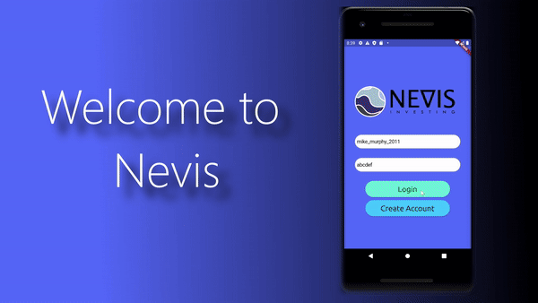

# Nevis FinTec App (Proof of Concept, in association with Tucker McKay)

Nevis is a proof-of-concept FinTec app conceptualized by Roanoke College Business Grad, Tucker McKay, and it allows app users to invest in Private Start-Up companies and create funds/portfolios comprised of these organizations.
The companies Nevis hosts are all geared towards making a positive impact in the world. Green energy, sustainability, climate activism, etc.

## Getting Started

Login Screen:
--------------
For demonstration purposes, there is only one login account, mike_murphy_2011. To login, simply type whatever text you please into the authentication fields and tap "login".

Main Tab Bar:
--------------
On the main tab bar, you will be able to view your username, profile photo, and account balance.

Home Tab:
---------
The home tab consists of two main elements:
A global map:
  - Each pin on the map corresponds to a company you have invested in's location.
  - Clicking on a pin will initiate a popup that shows you information about that company.

A update notifcation feed:
  - Each notification contains recent information about a company you have invested in.

News Tab:
----------
  - The news tab contains links to the latest articles about one of your investments. Tapping on an article link will redirect you to the article's website.

Invest Tab:
------------
  - A chart is displayed showing funds you have invested in. Each fund in made up of a collection of various companies.
  - Below the chart are buttons leading to a breakdown page of the funds. On each breakdown page, there is an option to allocate funds away from your account balance       and into the fund.

Connect Tab:
------------
  - The connect tab is a demo page displaying a social media connection feature. The idea is the true Nevis app will allow you to follow other investors and share         posts, thoughts, and other information. There is also a like and comment interaction feature available.

Profile Tab:
------------
  - The profile tab allows users to view their profile information and edit things like authentication information, location, occupation, and banking information. There is also a privacy policy and a logout button.

